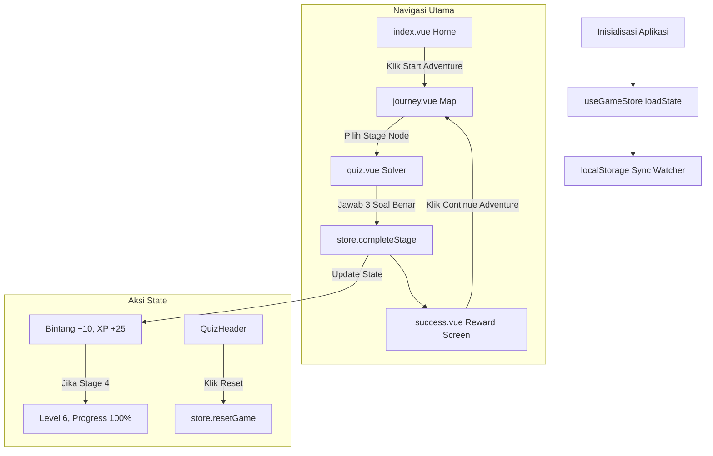

# QuizQuest Adventure - Project Architecture & Technical Summary

## 1. Executive Summary & Overview
Document ini menyajikan analisis struktural, logika, dan visual yang komprehensif dari aplikasi web **QuizQuest Adventure**. Dokumen ini dirancang agar dapat dianalisis dan diproses dengan mudah oleh model AI maupun pengembang.

- **Tujuan Aplikasi**: Aplikasi kuis dan trivia interaktif anak-anak berbasis petualangan (gamified).
- **Framework**: [Nuxt 4](https://nuxt.com/) (Vue 3 Composition API dengan `<script setup>`).
- **Sistem Desain**: TailwindCSS v4 dengan Custom CSS Properties (Variables) untuk token desain, Google Fonts (Quicksand, Plus Jakarta Sans, Noto Serif JP, Klee One), serta gaya visual Neomorphic "Bubbly".
- **Manajemen State**: Vue `reactive` composable (`useGameStore.ts`) dengan sinkronisasi dan persistensi `localStorage`.
- **Fitur Visual**: Background WebGL GLSL fragment shader dinamis (`ShaderBackground.vue`), efek hujan confetti murni CSS (`Confetti.vue`), ikon Material Symbols Outlined, serta navigasi responsif mobile & desktop.

---

## 2. Struktur Direktori & Pemetaan File

```
quiz/
├── app/
│   ├── app.vue                   # Root entry component (<UApp>, <NuxtLayout>, <NuxtPage>)
│   ├── assets/
│   │   └── css/
│   │       └── main.css          # Token sistem desain, variabel CSS, gaya neomorphic bubbly, animasi
│   ├── components/
│   │   ├── Confetti.vue          # Engine animasi confetti acak murni CSS/JS
│   │   ├── QuizHeader.vue        # Navigation bar atas global (Status pemain: Bintang, Level, Tombol Reset)
│   │   └── ShaderBackground.vue  # Canvas background shader WebGL GLSL real-time
│   ├── composables/
│   │   └── useGameStore.ts       # Store state global (bintang, level, xp, status stage, sync localStorage)
│   ├── layouts/
│   │   └── default.vue           # Layout default wrapper (<slot />)
│   └── pages/
│       ├── index.vue             # Halaman utama (Hero, Mascot, CTA, dan kartu statistik Bento Grid)
│       ├── journey.vue           # Peta interaktif (5 stage nodes, garis jalur, dan penanda maskot)
│       ├── quiz.vue              # Layar pengerjaan kuis interaktif (umpan balik suara Web Audio API & bubble speech)
│       └── success.vue           # Layar selebrasi kelulusan stage (+10 Bintang, +25 XP)
├── public/                       # Aset publik statis (avatar.png, logo.png, mascot.png, icons)
├── tests/                        # Script pengujian End-to-End (Playwright test suite)
├── nuxt.config.ts                # Konfigurasi Nuxt (Font Google, Modul UI, Transisi Halaman)
├── package.json                  # Manifest dependensi & script runner
└── summary.md                    # Dokumen rangkuman arsitektur & logika ini
```

---

## 3. Analisis Logika & Flow Sistem

### 3.1 Manajemen State & Persistensi (`app/composables/useGameStore.ts`)
- **Pola State Reaktif**: Menggunakan satu instance objek `reactive()` tunggal berdasarkan state awal `DEFAULT_STATE`.
- **Model Data (`GameState`)**:
  - `stars` (number): Jumlah total bintang yang dikumpulkan pemain (default: `120`).
  - `level` (number): Level pemain saat ini (default: `5`).
  - `xp` (number): Poin pengalaman / XP (default: `1200`).
  - `worldProgress` (number): Persentase kemajuan dunia (default: `75`).
  - `completedStages` (`Record<number, StageProgress>`): Objek pendaftaran status stage 1..5 (`{ stars: number, completed: boolean }`).
  - `currentStage` (number): Pointer stage aktif saat ini (default: `4`).
- **Sinkronisasi Persistensi (`localStorage`)**:
  - Key penyimpanan: `'kids_quest_adventure_state'`.
  - Fungsi `loadState()` membaca data JSON tersimpan saat hidrasi klien.
  - Fungsi `saveState()` dipicu secara otomatis oleh watcher reaktif `watch(state, ..., { deep: true })`.
  - Dilengkapi guard `typeof window !== 'undefined'` untuk keamanan Server-Side Rendering (SSR).
- **Mutator State**:
  - `completeStage(stageNum: number, starsEarned: number)`: Memperbarui status kelulusan stage, menambahkan 10 bintang dan 25 XP. Jika stage 4 diselesaikan, otomatis menaikkan level ke Level 6 dan world progress ke 100%.
  - `resetGame()`: Mengembalikan seluruh state ke `DEFAULT_STATE` dan memperbarui `localStorage`.

### 3.2 Alur Navigasi & Routing
- **`index.vue` (`/`)**: Beranda utama. Tombol CTA mengarahkan ke `/journey`.
- **`journey.vue` (`/journey`)**:
  - Rendring 5 node stage secara vertikal di atas jalur 800px.
  - Penentuan unlock (`isUnlocked(stageNum)`): Stage 1 selalu terbuka. Stage berikutnya terbuka jika stage `N-1` telah selesai atau `currentStage >= N`.
  - Handler klik (`clickNode(stageNum)`): Berpindah ke `/quiz?stage=N` jika stage sudah terbuka; memberikan log jika stage terkunci.
- **`quiz.vue` (`/quiz`)**:
  - Membaca parameter stage dari query URL (`route.query.stage`).
  - Menyediakan dataset soal kuis spesifik per stage (`questionsByStage` 1..5):
    - **Stage 1**: Hewan & Lautan (Dolphin, Eagle, Lion).
    - **Stage 2**: Bentuk & Geometri (Triangle, Circle, Star).
    - **Stage 3**: Buah & Makanan Sehat (Apple, Banana, Grapes).
    - **Stage 4**: Alam & Hutan (Trees, Raindrops, Sun).
    - **Stage 5 (Grand Final Review)**: Soal komprehensif yang menghubungkan materi Stage 1-4 (Contoh: Menghubungkan Lumba-lumba Stage 1, Apel merah bundar Stage 2&3, dan Bentuk Segitiga Pohon Pinus Stage 4).
  - Tracking status: `currentQuestionIdx`, `wrongSelections`, `selectedOptionText`, `showCorrectTransition`.
  - Audio Synthesizer (`playBubbleSound`): Memanfaatkan HTML5 Web Audio API (`AudioContext`) untuk menghasilkan efek suara nada secara sintetis tanpa memerlukan file `.mp3` eksternal (Dual chime C5/E5 untuk jawaban benar, gelombang segitiga untuk jawaban salah).
  - Penyelesaian: Setelah soal terakhir selesai, memanggil `store.completeStage(stageId, 3)` dan berpindah ke `/success`.
- **`success.vue` (`/success`)**:
  - Menampilkan kartu rincian hadiah (+10 Bintang, +25 XP).
  - Memicu hujan confetti visual melalui `<Confetti />`.
  - Tombol CTA mengarahkan kembali ke `/journey`.

---

## 4. Analisis Visual & Sistem Desain

### 4.1 Sistem Desain Neomorphic "Bubbly" (`app/assets/css/main.css`)
- **Konsep Estetika**: Tema anak-anak yang ramah, bulat (pill-shaped, rounded cards), dengan border tebal berkontras tinggi dan bayangan fisik 3D pada tombol.
- **Palet Warna Utama**:
  - Primary (`#705d00` / `#ffd93d`): Kuning cerah (Sunshine Yellow).
  - Secondary (`#005db8` / `#4c96fe`): Biru langit (Sky Blue).
  - Tertiary (`#006e29` / `#8ff199`): Hijau padang rumput (Meadow Green).
  - Surface (`#fff8ef` / `#f5eddd`): Krem hangat (Warm Cream).
  - Outline (`#7e7761` / `#d0c6ad`): Cokelat pasir (Sand Beige).
- **Mekanisme Tombol Interaktif (`.bubbly-btn`)**:
  - Border solid 3px.
  - Drop shadow vertikal tegas (`box-shadow: 0 8px 0 0 [border-color]`).
  - Animasi taktil saat ditekan (`:active` mengubah posisi `translateY(4px)` dan mengecilkan shadow menjadi `4px`).

### 4.2 WebGL GLSL Shader Background (`app/components/ShaderBackground.vue`)
- **Arsitektur Grafis**: Menggunakan konteks canvas WebGL 1.0 murni (`gl.getContext('webgl')`).
- **Program Shader**:
  - Vertex Shader: Memetakan koordinat 2D quad `[-1, -1]` ke `[1, 1]`.
  - Fragment Shader: Menghitung gradien langit biru dinamis menggunakan fungsi gelombang sinus `sin(uv.x * 3.0 + u_time * 0.5)` dan efek kilauan bintang (sparkles) berbasis dot-product noise.
- **Manajemen Resource**: Menggunakan `requestAnimationFrame`, `ResizeObserver` untuk ukuran window, serta pembersihan memori buffer/shader pada hook `onUnmounted`.

### 4.3 Struktur Komponen & Tata Letak Visual
1. **`QuizHeader.vue`**: Header tetap (`h-[80px]`, `z-50`) berisi judul aplikasi, tombol kembali, counter Bintang, badge Level, tombol Reset state, dan avatar karakter.
2. **`Confetti.vue`**: Menggenerasi 60 elemen potongan kertas warna-warni acak dengan animasi CSS `@keyframes fall`.
3. **`index.vue`**: Menampilkan elemen atmosfer (awan melayang `.cloud-md`, bintang berkedip), grafik maskot dengan bayangan lembut, serta Bento Grid untuk statistik pemain.
4. **`journey.vue`**: Menggunakan gradien latar belakang peta alam, jalur terhubung dengan garis dash/solid `.path-line`, serta indikator maskot melompat (`animate-mascot-bounce`) pada stage aktif.
5. **`quiz.vue`**: Menyajikan progress bar gelembung terhubung (`active-bubble-pulse`), tombol pilihan jawaban dinamis (Kuning = netral, Hijau = benar, Merah = salah), serta balon percakapan (speech bubble) interaktif maskot.

---

## 5. Diagram Alur Data & Komponen



---

## 6. Catatan Ringkas Untuk Model AI / Developer Next Phase
- **Penambahan Soal Kuis**: Soal kuis saat ini didefinisikan pada array `questions` di [quiz.vue](file:///e:/OPPA%20MITO%20DEV/learning/quiz/app/pages/quiz.vue). Dapat diekstrak ke file JSON eksternal jika ingin menambah daftar soal secara terpisah.
- **Penambahan Stage Baru**: Dapat memperbarui `DEFAULT_STATE.completedStages` di [useGameStore.ts](file:///e:/OPPA%20MITO%20DEV/learning/quiz/app/composables/useGameStore.ts) dan menambahkan posisi node baru di [journey.vue](file:///e:/OPPA%20MITO%20DEV/learning/quiz/app/pages/journey.vue).
- **Audio Output**: Fitur audio menggunakan Web Audio API tanpa dependensi file media.
